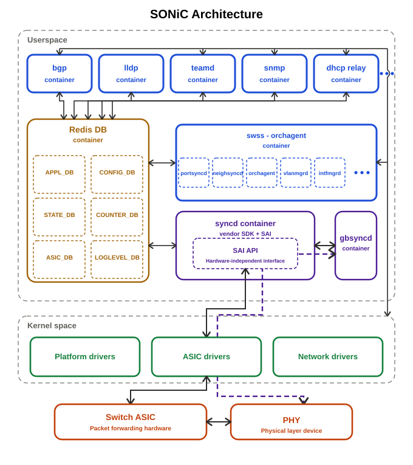

# What is SONiC

SONiC (Software for Open Networking in the Cloud) is an open-source network
operating system (NOS) hosted by the Linux Foundation. It is built on Linux and
designed to run on switches from multiple silicon and hardware vendors using a
common set of open APIs—the [Switch Abstraction Interface
(SAI)](https://github.com/opencomputeproject/SAI).

SONiC separates the network software stack from the underlying switch hardware.
That disaggregation lets operators mix and match switch ASICs, platforms, and
software components while running a consistent NOS across data-center, cloud,
enterprise, and AI networking deployments. Control-plane protocols, management
daemons, and platform services run as independent processes, typically packaged
in Docker containers, and coordinate through a shared configuration and state
database.

The [SONiC Wiki](https://github.com/sonic-net/SONiC/wiki) is the primary
community resource for project overview, design discussions, feature notes, and
operational guides. For a deeper look at how the components fit together, see
[SONiC Architecture](https://github.com/sonic-net/SONiC/wiki/Architecture).

Key Features
============

SONiC relies on a disaggregated, containerized architecture where individual
open-source control plane and management components run inside isolated Docker
containers. The diagram below illustrates the main layers; the linked
[architecture guide](https://github.com/sonic-net/SONiC/wiki/Architecture)
describes each component in more detail.

- **Disaggregated Architecture**: Separates the network software stack from the
  underlying physical switch hardware using the [Switch Abstraction Interface
  (SAI)](https://github.com/opencomputeproject/SAI).
- **Containerized environment**: SONiC uses micro-services approach that
  isolates network protocols into separate [Docker](https://www.docker.com/)
  containers. This allows flexibility to start/stop/restart any protocol
  container independently hence add fault-tolerance - i.e. faulty containers
  does not affect full stack.
- **Feature rich protocols**: SONiC already supports most of the network
  protocols and community is adding next-gen protocols for data-center,
  enterprise and AI target deployments.
- **Open-source control plane integration**: SONiC adapts open-source control
  plane components which runs inside containers. For eg: SONiC uses
  [FRR](https://frrouting.org/) for standard route engines like BGP, OSPF,
  IS-IS, BFD protocols, [LLDPd](https://lldpd.github.io/) that tracks network
  topologies and collects adjacent physical device data,
  [Teamd](https://manpages.ubuntu.com/manpages/bionic/man8/teamd.8.html)
  that manages Link Aggregation Groups (LAG), standard LACP control logic
  and many others. SONiC also integrates open-source tools like -
  [Docker](https://www.docker.com/) for containers,
  [Debian](https://www.debian.org/) for release packages,
  [libnl](https://www.infradead.org/~tgr/libnl/) for interacting with LINUX
  network stack, [gRPC](https://grpc.io/) for telemetry and
  [Python](https://www.python.org/) for management CLI, test and validation and
  sourcing data from one format to another.
- **Extensive Verification**: SONiC network usecases are verified in multiple
  network topologies via [PTF](https://github.com/sonic-net/sonic-mgmt) which
  stands for _Packet Test Framework_.
- **Support for Whitebox Switch development**: SONiC-VS(Virtual Switch) is a
  containerized, software-only emulation of SONiC. It allows developers to
  prototype, test, and automate white-box networking topologies on standard
  virtual machines or emulators like [GNS3](https://gns3.com/)

Useful Links
============
- [SONiC Wiki](https://github.com/sonic-net/SONiC/wiki)
- [SONiC Architecture](https://github.com/sonic-net/SONiC/wiki/Architecture)
- [SONiC CLI Guide](https://github.com/sonic-net/sonic-utilities/blob/master/doc/Command-Reference.md#acl)
- [OCP SAI](https://github.com/opencomputeproject/SAI)
